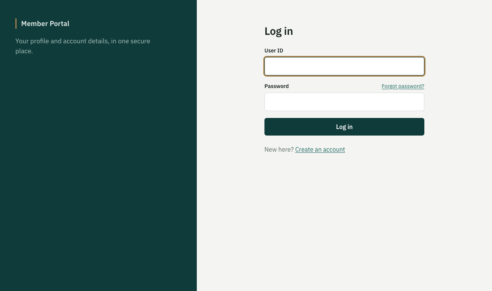
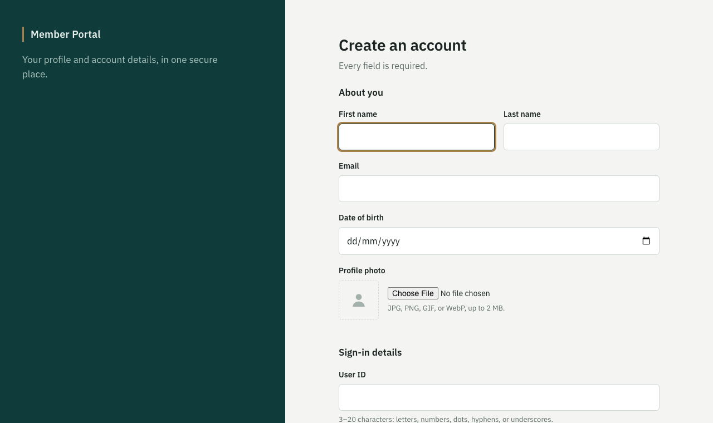
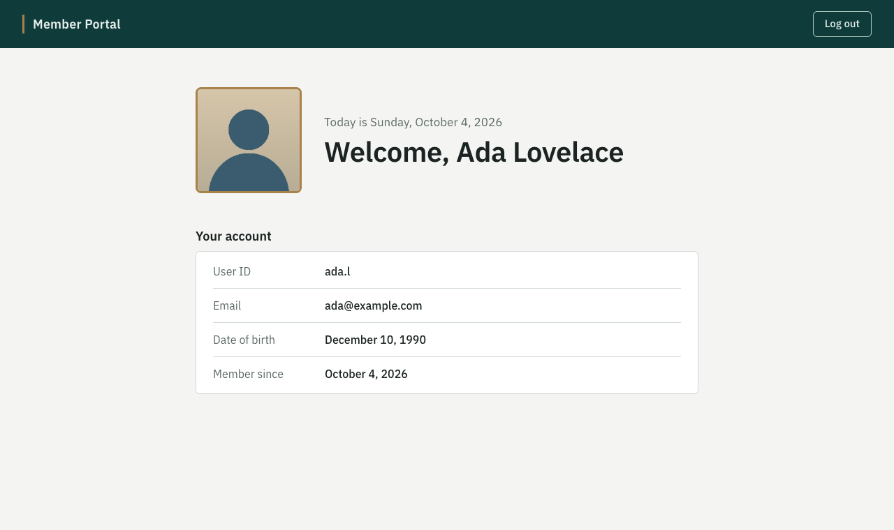

# Project Five: JSP Login Page

A JSP login application running on Apache Tomcat. Users register (with a photo), log in against a SQL database over JDBC, recover a forgotten password, and land on a personal page showing today's date, a welcome message, and their photo.

*Option A (JSP Login) was chosen over Option B (Twitter Comparison) because reading tweets through the X (Twitter) API now requires a paid plan.*

| Log in | Create an account | Landing page |
|--------|-------------------|--------------|
|  |  |  |

## Project Plan

| # | Task | Estimated time | Depends on | Actual time |
|---|------|----------------|------------|-------------|
| 1 | Set up the environment (JDK, Maven, Tomcat) | 1 hr | — | |
| 2 | Create the users table (SQL) and JDBC connection | 1 hr | Task 1 | |
| 3 | Login page and credential check | 2 hrs | Task 2 | |
| 4 | Registration page (5+ inputs, including photo) and confirmation page | 3 hrs | Task 2 | |
| 5 | Forgot-password page | 1.5 hrs | Task 2 | |
| 6 | Landing page (date, welcome, photo) and logout | 1.5 hrs | Task 3 | |
| 7 | Errors, confirmations, and a consistent theme across all pages | 2 hrs | Tasks 3–6 | |
| 8 | Tests, README, and review | 1.5 hrs | Tasks 3–7 | |
| | **Total** | **13.5 hrs** | | |

## Requirements Checklist

| Requirement | Where |
|-------------|-------|
| Login page with User ID and password | `/login`, [login.jsp](src/main/webapp/WEB-INF/views/login.jsp) |
| Credentials checked against a database | [LoginServlet](src/main/java/com/ithena/jsplogin/web/LoginServlet.java) → [UserDao](src/main/java/com/ithena/jsplogin/db/UserDao.java) (JDBC) |
| Landing page: today's date, welcome by name, user's photo | `/home`, [home.jsp](src/main/webapp/WEB-INF/views/home.jsp) |
| Registration page with at least 5 inputs, plus User ID and password | `/register`: first name, last name, email, date of birth, photo, User ID, password, confirm password |
| Confirmation page that links back to login | `/registered` |
| Forgot-password page that links back to login | `/forgot-password` |
| Errors and confirmations on every page | Inline field errors, page notices, and themed 404/500 pages |
| Logout option | "Log out" button on the landing page |
| Coherent, professional theme | One stylesheet and shared layout for every page, responsive down to phone width |

## Run It

**Prerequisite:** JDK 17 or later. Maven and Tomcat do not need to be installed: the Maven wrapper (`./mvnw`) downloads them.

```bash
./mvnw package cargo:run
```

Open <http://localhost:8080/jsp-login>, create an account, and log in. Stop the server with Ctrl+C.

**On an existing Tomcat 11** (instead of the command above):
1. Build with `./mvnw package`.
2. Copy `target/jsp-login.war` into Tomcat's `webapps/` folder.
3. Start Tomcat with `bin/startup.sh` (or `bin\startup.bat` on Windows).

## Database

The app uses JDBC with an embedded **H2** SQL database, so there is nothing to install. The database file is created at `~/.jsp-login/` on first start. The table definition is [schema.sql](src/main/resources/schema.sql), which runs automatically when the app starts.

**Switching to MySQL** (or another SQL database):
1. Add the driver dependency (`com.mysql:mysql-connector-j`) to `pom.xml`.
2. Create the database, then set these environment variables before starting Tomcat:
   ```bash
   export DB_DRIVER=com.mysql.cj.jdbc.Driver
   export DB_URL=jdbc:mysql://localhost:3306/jsplogin
   export DB_USER=... DB_PASSWORD=...
   ```

The same settings are context parameters in [web.xml](src/main/webapp/WEB-INF/web.xml).

> **About the "ODBC DSN" hint:** the JDBC-ODBC bridge was removed in Java 8. A modern Java app connects through a JDBC driver instead, and the JDBC URL above plays the role a DSN used to.

## Design

The app follows **MVC**:
- **Servlets** (controllers) handle requests.
- **JSPs** (views, under `WEB-INF/` so they cannot be opened directly) render HTML with JSTL.
- A **DAO** class holds all the SQL.

Database code stays out of the JSPs.

```
src/main/java/com/ithena/jsplogin/
  web/         LoginServlet, RegisterServlet, RegisteredServlet, ForgotPasswordServlet,
               HomeServlet, PhotoServlet, LogoutServlet, AuthFilter, SecurityHeadersFilter,
               AppContextListener (connects to the database at startup)
  db/          Database (JDBC connection + schema), UserDao (all SQL)
  security/    PasswordHasher (PBKDF2)
  validation/  Validator (form rules), ImageTypes (checks uploaded files are real images)
  model/       User, Photo, Registration
src/main/webapp/
  WEB-INF/views/   login, register, registered, forgot-password, home, error (JSP)
  WEB-INF/tags/    field.tag (reusable labelled input with hint and error)
  assets/          CSS, JS (photo preview), images
```

### Security

| Concern | How it's handled |
|---------|------------------|
| Password storage | Salted PBKDF2-HMAC-SHA512 hashes (210,000 iterations). Plain-text passwords are never stored |
| Forgotten passwords | Hashes can't be reversed, so the app **resets** the password instead of revealing it: the user confirms User ID + email + date of birth and chooses a new one |
| SQL injection | Every query uses `PreparedStatement` parameters |
| Cross-site scripting (XSS) | All user data is escaped in JSPs (`fn:escapeXml`), and a Content-Security-Policy is set |
| Session hijacking | A new session is created at login, and the cookie is `HttpOnly` and `SameSite=Lax`. Logout is a POST, and private pages are sent `no-store` so the Back button can't show them after logout |
| User ID enumeration | The same login error is shown for an unknown user and a wrong password, and both take the same time |
| Malicious uploads | Photos are limited to 2 MB and checked by their file signature (JPEG/PNG/GIF/WebP), not by the name the browser sends |

A production deployment would also add HTTPS, a pooled JNDI DataSource, emailed reset links, and rate limiting on login and reset.

## Tests

```bash
./mvnw test
```

19 JUnit tests cover password hashing, form validation, image detection, and every DAO query (against an in-memory H2 database using the real `schema.sql`). Every page flow was also tested end-to-end in a browser on Tomcat 11.
