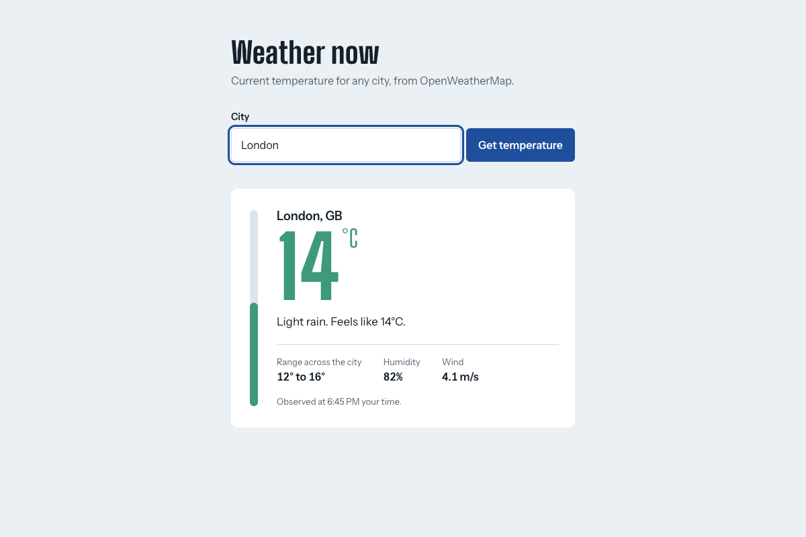

# Weather App (OpenWeatherMap)

A small Express backend that calls the [OpenWeatherMap Current Weather API](https://openweathermap.org/current) and a web page that shows the current temperature for a city.



## How it works

```
Browser ──GET /api/weather?city=London──► Express backend ──GET /data/2.5/weather?q=London&units=metric&appid=KEY──► OpenWeatherMap
   ◄──────────── JSON summary ───────────────────┘ ◄──────────────────────── JSON ───────────────────────────────────┘
```

- The **backend** holds the API key, so the key is never sent to the browser.
- The backend calls OpenWeatherMap and returns a small JSON summary.
- The **page** (`public/`) calls the backend and shows the result.

## Run it

Requires Node.js 22.9 or later.

1. Get a free API key: sign up at <https://home.openweathermap.org/users/sign_up>, then copy your key from <https://home.openweathermap.org/api_keys>. New keys can take up to 2 hours to activate.
2. Install and configure:
   ```bash
   npm install
   cp .env.example .env      # then paste your key into .env
   ```
3. Start the app:
   ```bash
   npm start                  # or: npm run dev (restarts on file changes)
   ```
4. Open <http://localhost:3000> and enter a city.

## API

`GET /api/weather?city={name}`

```json
{
  "city": "London", "country": "GB",
  "temperature": 14.2, "feelsLike": 13.6, "tempMin": 12.1, "tempMax": 15.8,
  "humidity": 82, "windSpeed": 4.1, "description": "light rain",
  "observedAt": "2026-10-04T22:00:00.000Z"
}
```

`tempMin`/`tempMax` are the spread of temperatures being observed across the city right now (as OpenWeatherMap defines them), not the day's forecast low/high.

| Status | When |
|--------|------|
| 200 | Weather found |
| 400 | City missing or longer than 100 characters |
| 404 | OpenWeatherMap does not know the city |
| 500 | `OPENWEATHER_API_KEY` is not set |
| 502 / 503 | OpenWeatherMap is unreachable, rejected the key, rate-limited the request, or sent an unexpected response |

Errors are returned as `{ "error": "message" }`.

## Tests

```bash
npm test
```

The tests use Node's built-in test runner and a fake `fetch`, so they need no API key or network connection.

## Project structure

```
src/server.js          starts the server (reads PORT and OPENWEATHER_API_KEY)
src/app.js             Express app and the /api/weather route
src/weatherService.js  calls OpenWeatherMap and maps the response
public/                web page (HTML, CSS, JS)
test/                  unit and HTTP tests
```
